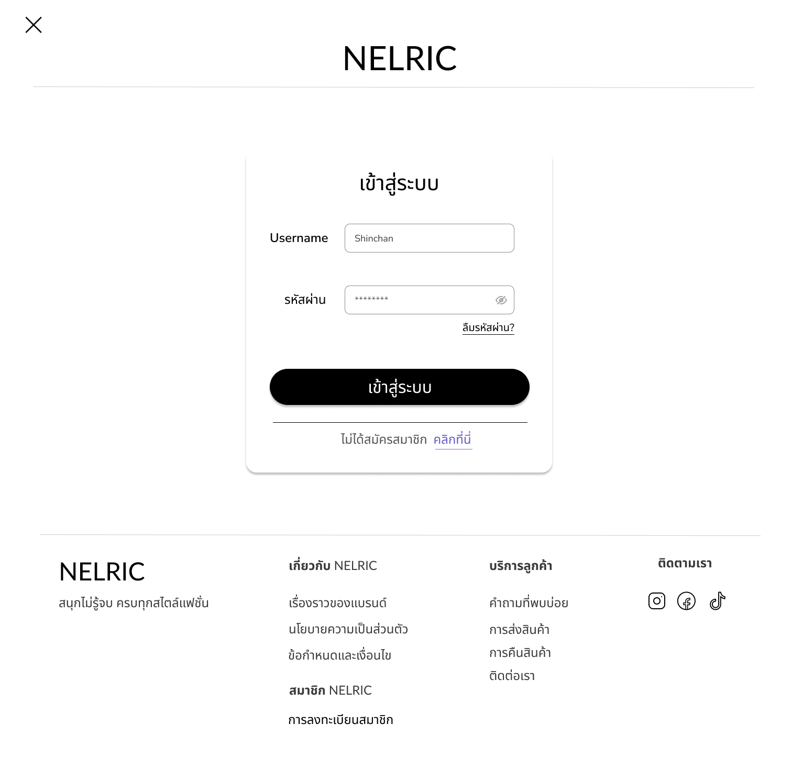
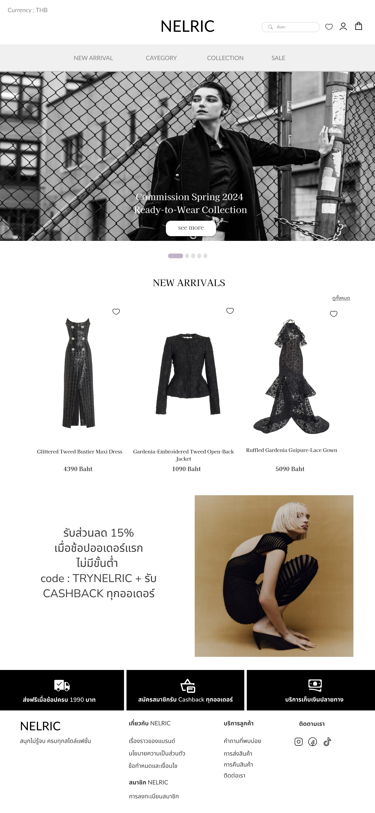
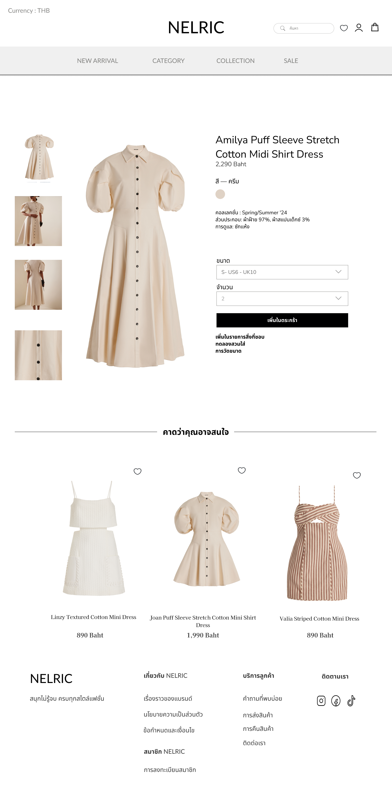
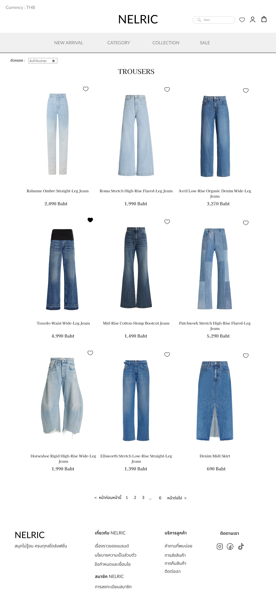
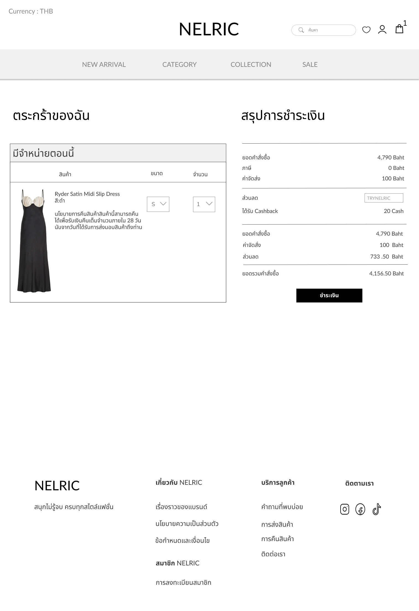
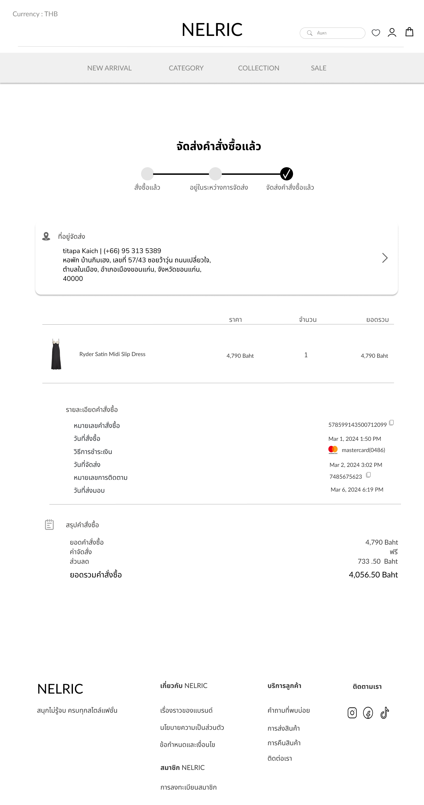
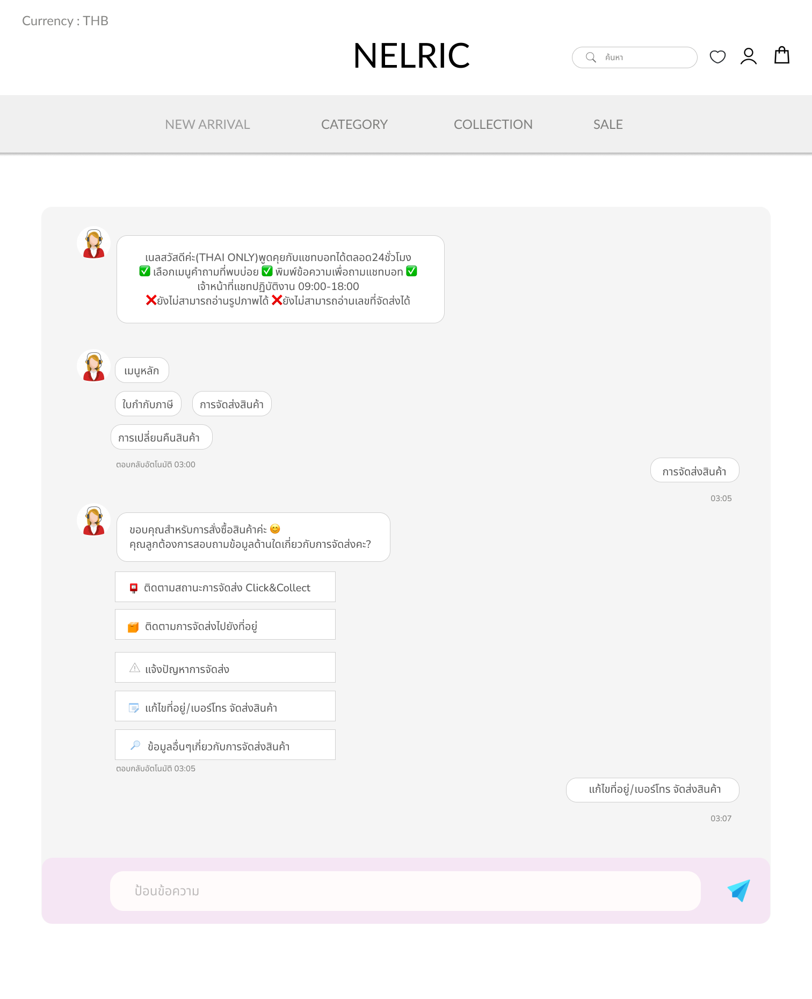

## UI/UX Design

This project's user interface was designed in Figma before development, covering the full shopping flow from login to checkout.

**Design File**: [View Full Design](https://www.figma.com/design/CAgz339yf5rrYV7QicLcWb/Bis?node-id=0-1&t=FxxhuhFP8JDU9Nxu-1)
**Interactive Prototype**: [Try the Prototype](https://www.figma.com/proto/CAgz339yf5rrYV7QicLcWb/Bis?node-id=210-708&p=f&t=m96iaqRCaid2uXf8-1&scaling=scale-down&content-scaling=fixed&page-id=0%3A1&starting-point-node-id=210%3A708)

### Screens
| Screen | Description |
|---|---|
|  | Login page for user authentication |
|  | Home page showcasing featured products and categories |
|  | Product detail page where users select a product to choose or view details before adding it to their cart |
|  | Category page for browsing jeans specifically |
|  | Shopping cart showing selected items |
|  | Checkout page for completing the purchase |
|  | Automated chatbot for answering customer inquiries |

### Design Decisions
- **Minimal login flow**: Kept the login screen simple with only essential fields to reduce friction for first-time shoppers.
- **Product-first home page**: Featured products and categories are visible immediately on the home page, letting users start browsing without extra navigation steps.
- **Direct add-to-cart from listing**: Users can add products to their cart straight from the listing page, without opening each product individually, to speed up the shopping flow.
- **Dedicated category pages**: Added a specific category page (e.g. Jeans) so customers looking for a particular product type can browse and filter faster.
- **Simplified cart and checkout**: Designed with a clear summary of items and price, and a straightforward step-by-step flow to reduce cart abandonment.
- **Automated chatbot support**: Integrated an automated chatbot so customers can get quick answers about sizing, materials, or order status without waiting for a human agent, improving response time.

### Tools Used
- **Figma** — wireframing, UI design, and interactive prototyping
